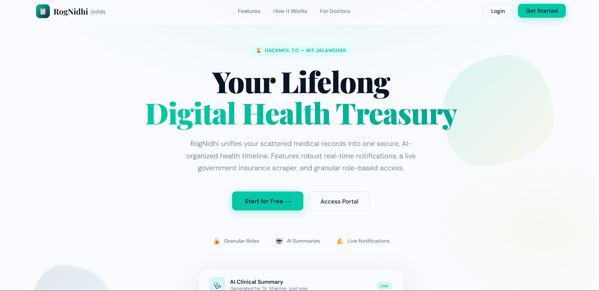
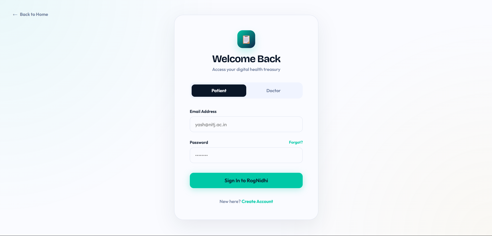
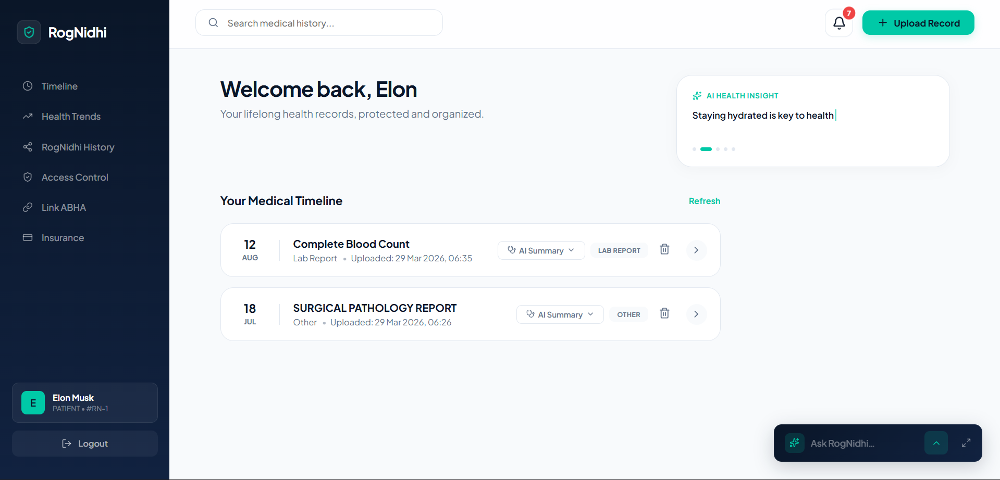
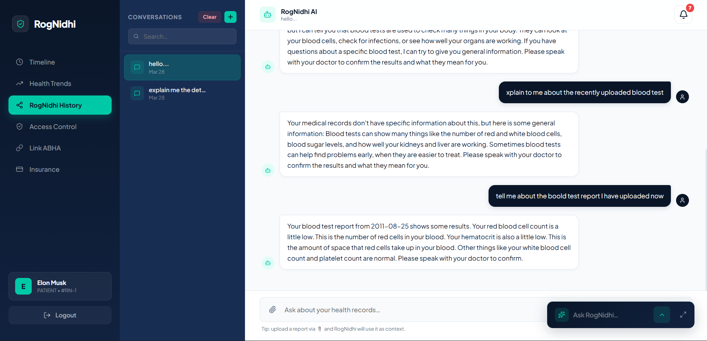
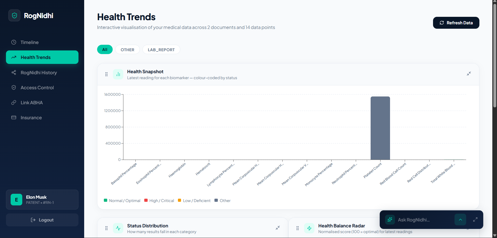
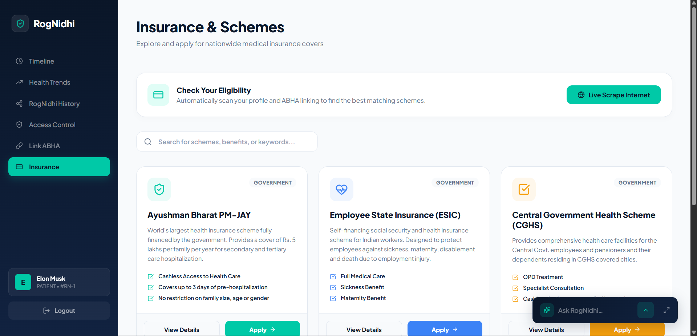
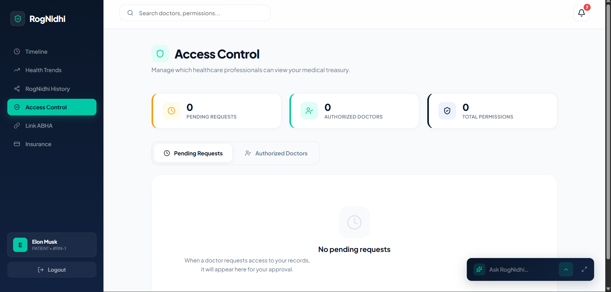

# RogNidhi (रोगनिधि) 🩺
**Your Lifelong Digital Health Treasury**

RogNidhi is an intelligent, AI-powered personal health record system designed to centralize fragmented medical histories. From handwritten prescriptions to complex digital lab reports, RogNidhi processes, organizes, and secures your lifelong medical data into a visual, chronological timeline.

---

## 🚩 The Problem
A patient's medical history is often scattered across paper files, diverse apps, and incompatible electronic systems. This fragmentation leads to:
* **Delayed Diagnoses:** Doctors waste time piecing together incomplete histories.
* **Redundant Tests:** Frequent repeats of diagnostic procedures due to missing records.
* **Patient Stress:** Individuals struggle to recall complex medical details spanning years.

## 💡 Our Solution
RogNidhi acts as a singular treasury for all medical information, providing a seamless, fully interoperable interface bridging patients and doctors.

---

### ✨ Key Platform Features

#### 👤 For Patients
* **Unified Health Timeline:** Store blood tests, pathology reports, handwritten prescriptions, and vaccination records in one chronological dashboard.
* **Automated Trend Visualization:** Generates real-time, interactive polar and line graphs of key health metrics (e.g., HbA1c, Hemoglobin) across your history.
* **Live Health Schemes Scraper:** An integrated "Schemes" explorer that live-scrapes the latest Ayushman Bharat and national health subsidies dynamically from government repositories.
* **Granular Access Control:** You retain complete ownership of your data. Temporarily grant and revoke access to specific doctors with a click.
* **Real-Time Notifications:** Distinct audio pings and visual overlay badges instantly notify you when a doctor requests access.

#### 👨‍⚕️ For Doctors
* **Instant Case Summaries:** Before a consultation begins, effortlessly receive an AI-generated clinical summary of the patient's entire medical history.
* **Consolidated Timeline View:** Navigate complex histories rapidly without reading through 50 raw PDF files.
* **Proactive Vitals Delivery:** The moment a patient grants you access, receive an automated push notification detailing their core vitals (Blood Group, Age, Allergies) so you are prepared.

---

## 🧠 Core AI Architecture

RogNidhi employs a hybrid Corrective Retrieval-Augmented Generation (cRAG) pipeline to analyze messy medical documents and prevent hallucinations.
1. **NVIDIA NeMo Retriever-OCR:** Extremely high-accuracy extraction of text from medical scans, blurry photos, and PDFs.
2. **FAISS Vector Indexing:** Every document uploaded builds an embedded matrix of the patient's lifelong history.
3. **Triple-Tier LLM Pipeline:** We intelligently route operations between **Gemini Flash 2.5** and **Groq (Llama 3.3)** to extract structured JSON entities, flag life-threatening abnormalities, and write human-readable clinical summaries *contextualized* against the patient's previous historical records.

---

## 🛠 Tech Stack

### **Presentation / UI Layer**
* **Framework:** React.js 19 + Vite
* **Language:** TypeScript
* **Styling & UX:** Vanilla CSS, `framer-motion` (Fluid UI animations), `recharts` (Data visualization)
* **Assets:** Lucide React (Dynamic iconography)

### **Backend API Layer**
* **Framework:** Django & Django REST Framework (DRF)
* **Authentication:** JWT (JSON Web Tokens) `rest_framework_simplejwt`
* **Scraping Layer:** `BeautifulSoup4` + `Requests` for real-time Wikipedia/Gov portal parsing

### **Data & DB Layer**
* **Database:** SQLite (Development) / MySQL (Production)
* **Storage:** Native Django File Storage (with cascading automated blob deletion)

### **AI & ML Layer**
* **LLMs:** Llama 3 (Groq API), Gemini 1.5/2.5 API
* **Vector DB:** FAISS
* **Embeddings:** HuggingFace `SentenceTransformers` MiniLM
* **Doc Processing:** `PyMuPDF` (Rapid PDF vectorization)

---
## 📸 Screenshots

### Landing Page


### Login Page


### Timelime Dashboard Page


### RogNidhiChat Page


### HealthTrends Page


### Insurance Schemes Page


### AccessControl Page


---

## 🚀 Local Development Setup

Follow these steps to spin up the RogNidhi ecosystem locally.

### 1. Backend Setup (Django)

Ensure you have Python 3.10+ installed.

```bash
cd backend
python -m venv venv
# On Windows:
venv\Scripts\activate
# On Mac/Linux:
# source venv/bin/activate

pip install -r requirements.txt
```

**Set up AI Environment Variables:**
You will need an `.env` file in the `ai/` folder containing your API keys:
`backend/ai/.env`:
```env
GROQ_API_KEY=your_groq_key
GEMINI_API_KEY=your_gemini_key
NVIDIA_API_KEY=your_nvidia_key
```

**Run Migrations & Start Server:**
```bash
python manage.py makemigrations
python manage.py migrate
python manage.py runserver
```
*The backend API will run at `http://127.0.0.1:8000`*

---

### 2. Frontend Setup (React)

Make sure you have Node.js 18+ installed.

```bash
cd frontend
npm install
npm run dev
```
*The application UI will run at `http://localhost:5173`*

---

## 🔮 Future Scope
* **ABHA Integrations:** Native mapping for the Ayushman Bharat Digital Mission (ABDM) national registry.
* **LangChain Orchestration:** Deeper chatbot intelligence leveraging LangGraph for multi-agent diagnostic reviews.
* **Wearable Integration:** Integrating Apple HealthKit & Google Fit data mapping directly into the UI.

---

## 👥 Team TLE (NIT Jalandhar)
* **Yash Patel** - 2nd Year
* **Aditya Soni** - 2nd Year
* **Ashima Sood** - 2nd Year
* **Udayveer Singh** - 2nd Year

*Created for **HackMol 7.0***